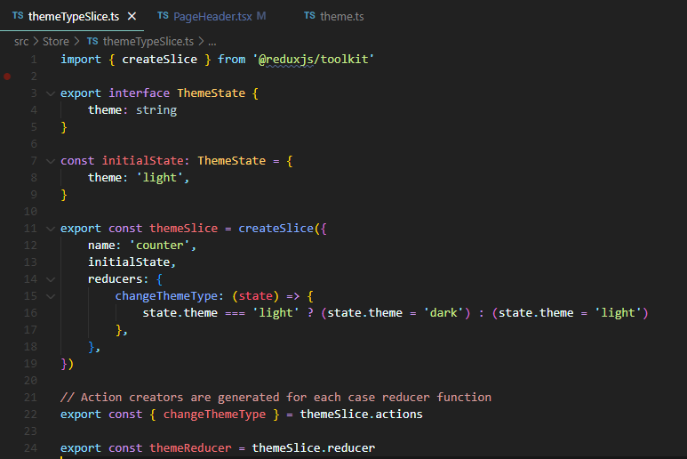
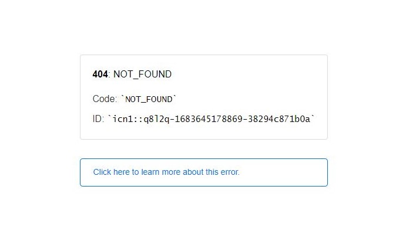

# Poketmon Master

기술 스택 (Front): React.js TypeScript Redux-Toolkit Styled-component 
깃허브 링크: https://github.com/umsungjun/PoketmonMaster 
배포 링크: https://poketmon-master.vercel.app/ 
주제: React와 TypeScript를 사용하여 Poke API 데이터를 활용하여 만든 포켓몬 도감 프로젝트 입니다. 
진행 기간: 2023년 3월 13일 → 2023년 3월 24일 
프로젝트 종류: 개인프로젝트 

## 프로젝트 소개

React와 TypeScript를 이용하여 구현한 포켓몬 도감 프로젝트 입니다.

컴포넌트 기반의 개발 방식과 TypeScript의 정적 타입 검사 기능을 활용하여 개발 생산성을 높혔습니다. 또한, Redux Toolkit을 이용하여 전역 상태를 효율적으로 관리하였으며, 이를 통해 상태의 변화를 간편하게 관리하는 법을 습득했습니다.

## 기능 구현

### Light / Dark 테마

-   기능 소개 : Header의 Theme 버튼(아이콘)을 통해서 Light 또는 Dark 테마를 적용할 수 있습니다.
-   기능 구현 : Redux-Toolkit을 이용하여 테마의 전역 상태를 간결하게 관리하였습니다. 테마 프로바이더를 이용하여 반복되서 사용되는 CSS 속성 값을 변수로 선언하여 코드의 중복을 줄였습니다.

  

Header에 있는 Theme 버튼을 눌렀을 때 changeThemeType 함수가 실행되는데 이때 현재 state의 값이 'light'일 경우 'dark'로, 'dark'일 경우 'light'로 변경됩니다.

  

 

useSelector를 사용해서 Redux store에서 현재 테마의 상태 값을 가져온 후, theme 변수에 저장하고 해당 컴포넌트의 props로 전달하여 테마 값에 따라 CSS를 적용했습니다.

### 무한스크롤

-   기능 소개 : Main Page에서 페이지 스크롤이 끝까지 내려갈 때마다 새로운 데이터를 불러와서 보여주는 무한스크롤 기능 입니다.
-   기능 구현 : 스크롤이 끝까지 내려갔을 때 useInfiniteScroll hook의 onLoadMore 콜백 함수가 호출되며, 해당 함수에서는 dispatch(fetchPoketMons(poketmons.next))가 실행되어서 기존에 데이터에 새로 받아온 데이터를 출력합니다.

  

  

### 이미지 타입 변경

-   기능 소개 : Header 우측에 있는 이미지 타입 selectBox를 통해서 Official, DreamWorld, FrontDefaulte 등의 이미지 타입을 선택하실 수 있습니다.
-   기능 구현 : 이미지 타입을 상수로 선언해두었고 pageHeader에 있는 selectBox를 통해서 onChange 이벤트가 발생되면 changeImageType 함수에 payload로 이미지 타입을 전달해서 전달받은 이미지 타입으로 현재 타입을 변경합니다.

  

 

 

 

### 카카오 공유하기

-   기능 소개 : 포켓몬 상세페이지 우측 상단에 있는 카카오 버튼을 누르면 현재 페이지의 포켓몬에 대한 정보가 포함된 카카오톡 메시지를 공유할 수 있습니다.
-   기능 구현 : 카카오 버튼을 KakaoShareButton component로 분리하였고 이 기능은 카카오 developers에서 제공하는 정보를 참고하여 구현하였습니다. 카카오톡 공유하기 기능을 통해서 현재 보고 있는 포켓몬에 대한 정보를 전달해야 하므로 React의 useParams() hook을 이용하여 url 변수 끝에 useParams()로 추출한 해당 포켓몬의 이름을 링크 끝에 추가하였습니다.

## 카카오 도메인 설정 관련 작성 글

[Poketmon Master 프로젝트 리팩토링](https://developer-sungjun.tistory.com/entry/Poketmon-Master-프로젝트-리팩토링)

  

 

 

 

## 이슈

### 이슈 1

-   이슈 : 기존에 제가 경험했던 무한 스크롤 방식은 페이지 네이션 기법이었는데 이번에는 서버에서 데이터를 받아올 때 next라는 이름으로 다음 데이터를 받아올 수 있는 파라미터가 있었기 때문에 다른 방식으로 구현해야 했기 때문에 혼동이 있었던 것 같습니다.
-   해결 방법 : 컴포넌트가 처음 렌더링 될 때 useEffect hook을 통해서 fetchPoketmons()를 통해 20개의 포켓몬 데이터를 가져왔습니다. 이후 스크롤이 끝까지 내려갔을 때 onLoadMore 함수를 통해 다음 페이지 데이터를 불러왔습니다. 이때 fetchPoketmons() 함수에 next 파라미터를 전달하였습니다. 그리고 fetchPoketmons() 함수에서는 전달받은 next 파라미터를 통해서 extraReducers에서 fulfilled 핸들러를 통해서 response가 fulfilled 된다면 기존에 배열 poketmon.results에 새로 가져온 데이터를 구조 분해 할당을 통해서 통합한 뒤 리덕스 스토어에 업데이트 해주었습니다.

  

 

### 이슈 2

-   이슈 : vercel로 배포한 도메인에서 새로고침을 했을 때 404 NOT_FOUND 오류가 났습니다.
-   해결 방법

vercel 공식 문서를 통해서 해결했습니다. 해결 방법은 최상위 루트에 vercel.json 파일 생성 후 아래의 코드를 입력해 주니 말끔하게 해결했습니다.

{
"rewrites": [{ "source": "/api/(.*)", "destination": "/api/404.js" }]
}

## [포켓몬 오류.JPG]

  

[How to Create and Deploy a Custom 404 Page](https://vercel.com/guides/custom-404-page)
